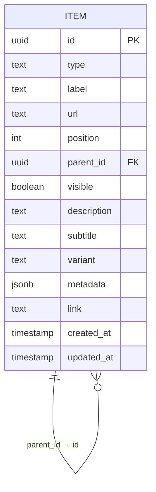
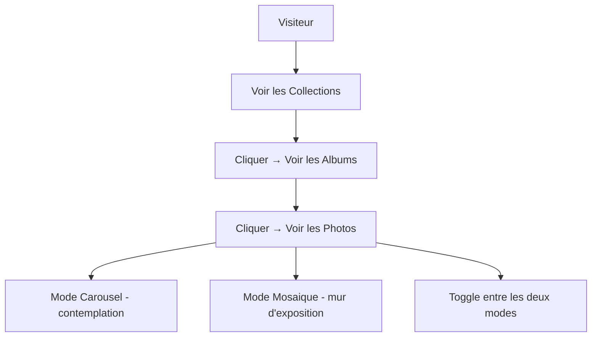
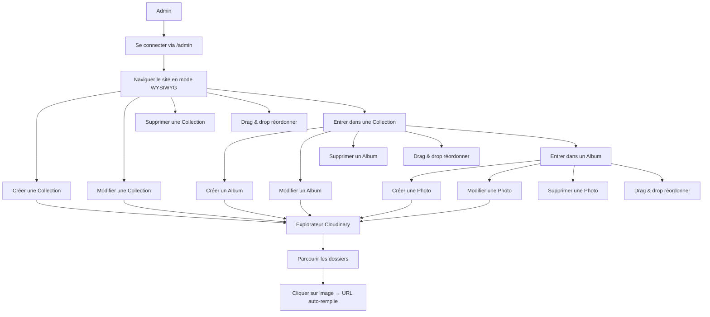

# Fondations du Projet — Atypique CMS
> mentalyas · Full-Stack Dev
> Date : 2026-04-26
> Statut : Brainstorm initial

---

## 1. Concept Global

Mini CMS intégré au site vitrine Atypique (Fine Art Wedding Photography) permettant de gérer le contenu du portfolio sans toucher au code. Le CMS est accessible via une URL cachée `/admin` et offre une interface WYSIWYG — l'admin navigue le site comme un visiteur mais avec des contrôles de création, modification, suppression et réorganisation (drag & drop) superposés. Le contenu est structuré en 3 niveaux hiérarchiques (Collections → Albums → Photos) basés sur un Item universel générique. Les images sont sélectionnées visuellement via un explorateur Cloudinary intégré en lecture seule.

**Utilisateur cible** : mentalyas uniquement (seul admin).
**Visiteurs** : clients potentiels découvrant le portfolio en ligne.

---

## 2. Fonctionnalites

### Fonctionnalites core (MVP)

- [ ] Authentification admin (email/mot de passe via Supabase Auth)
- [ ] Route `/admin` cachée avec login
- [ ] Mode WYSIWYG — navigation miroir du site avec controles admin superposés
- [ ] Item universel : CRUD (Create, Read, Update, Delete) a chaque niveau
- [ ] Hiérarchie 3 niveaux : Collections → Albums → Photos
- [ ] Champ `type` sur l'Item : "collection", "album", "photo" (extensible)
- [ ] Champ `variant` : "standard" par défaut (préparé pour modeles visuels futurs)
- [ ] Champ `metadata` JSON libre (préparé pour EXIF, tags, etc.)
- [ ] Champ `visible` : brouillon / publié
- [ ] Drag & drop pour réorganiser l'ordre des items
- [ ] Explorateur Cloudinary intégré (lecture seule) : navigation dossiers + sélection image visuelle
- [ ] Proxy sécurisé pour l'API Cloudinary (Edge Function — credentials jamais exposés au client)
- [ ] Mode vue Carousel (existant) : photo unique + texte poétique a droite
- [ ] Mode vue Mosaique "mur d'exposition" : cadres accrochés, rotations légères, désordre organique élégant, scroll vertical
- [ ] Toggle visiteur pour basculer entre Carousel et Mosaique
- [ ] Déploiement sur Vercel avec auto-deploy depuis GitHub

### Fonctionnalites secondaires (v2+)

- [ ] Variantes visuelles sélectionnables depuis le CMS ("polaroid", "cadre-doré", "minimaliste", etc.)
- [ ] Domaine personnalisé `atypique-studio.com`
- [ ] SEO : meta tags, Open Graph, sitemap, robots.txt
- [ ] Analytics (Plausible ou GA4)
- [ ] Version multilingue (FR/EN)
- [ ] Lazy loading avancé et optimisation Cloudinary (transformations URL)
- [ ] Preview mode : voir un item en brouillon avant publication
- [ ] Formulaire de contact fonctionnel (Resend / EmailJS)

### Hors scope (explicitement exclu)

- Gestion multi-utilisateurs / rôles
- Écriture sur Cloudinary depuis le CMS (upload, suppression, création de dossiers)
- CMS externe ou headless tiers (Strapi, Sanity, etc.)
- E-commerce / paiement
- Blog / articles

---

## 3. Structure de Base de Données

### Entités principales

| Entité | Champs clés | Relations |
|--------|-------------|-----------|
| **Item** | id (UUID), type, label, url, description, subtitle, variant, metadata (JSON), link, visible, position, parent_id, created_at, updated_at | parent_id → Item.id (auto-référence hiérarchique) |
| **User (Supabase Auth)** | id, email, password_hash | Géré nativement par Supabase Auth, pas de table custom |

### Modele Item universel — détail des champs

```
Item {
  // --- Communs (tous les types) ---
  id            UUID        PK, auto-généré
  type          TEXT        "collection" | "album" | "photo" | ... (extensible)
  label         TEXT        Titre affiché
  url           TEXT        URL image Cloudinary (couverture ou photo)
  position      INTEGER     Ordre d'affichage (géré par drag & drop)
  parent_id     UUID?       FK → Item.id (null = racine/collection)
  visible       BOOLEAN     true = publié, false = brouillon

  // --- Optionnels (selon le type) ---
  description   TEXT?       Texte poétique (carousel) ou description
  subtitle      TEXT?       Sous-titre
  variant       TEXT        Modele visuel, défaut "standard"

  // --- Réservés (futur) ---
  metadata      JSONB?      Champ libre (EXIF, date, lieu, tags...)
  link          TEXT?       URL externe optionnelle

  // --- Timestamps ---
  created_at    TIMESTAMP   Auto
  updated_at    TIMESTAMP   Auto
}
```

### Hiérarchie par parent_id

```
Collection (parent_id = null, type = "collection")
  └── Album (parent_id = collection.id, type = "album")
        └── Photo (parent_id = album.id, type = "photo")
```

### Diagramme ERD (Mermaid)



---

## 4. Diagrammes Use Cases (Mermaid)

### Visiteur



### Admin



---

## 5. Stack Technologique Recommandée

| Couche | Technologie | Justification |
|--------|-------------|---------------|
| Frontend | React 19 + TypeScript 5 + Vite 6 | Déja en place, stack moderne et performante |
| Styling | Tailwind CSS (install locale) | Passer du CDN a l'install npm pour le build prod |
| Animations | Framer Motion 12 | Déja en place, utilisé pour drag & drop + animations existantes |
| Base de données | Supabase (PostgreSQL) | Gratuit, SQL familier, API auto-générée, RLS intégré |
| Auth | Supabase Auth | Intégré, email/mdp, session JWT |
| Edge Functions | Supabase Edge Functions | Proxy sécurisé pour l'API Cloudinary |
| CDN Images | Cloudinary | Déja en place, transformations d'image a la volée |
| Hébergement | Vercel | Gratuit, auto-deploy GitHub, preview branches, HTTPS auto |
| Routing | React Router (a ajouter) | Nécessaire pour `/admin` et navigation interne |

### Dépendances a ajouter

```
@supabase/supabase-js    → Client Supabase (DB + Auth)
react-router-dom         → Routing (`/admin`, navigation)
```

---

## 6. Algorithmes & Patterns Techniques

- **Self-referencing table** — Une seule table `Item` avec `parent_id` pointant vers elle-même. Permet une hiérarchie infinie sans multiplier les tables. Pattern classique pour les arbres en SQL.

- **WYSIWYG Admin overlay** — Le site public et le CMS partagent les mêmes composants React. En mode admin, un Context React injecte les contrôles (boutons CRUD, drag handles) par-dessus les composants existants. Pas de duplication de code.

- **Optimistic updates** — Quand l'admin modifie un item, le UI se met a jour immédiatement (sans attendre la réponse Supabase), puis confirme ou rollback si erreur. UX fluide, surtout pour le drag & drop.

- **Position reindexing** — Le drag & drop modifie le champ `position`. Algorithme : lors d'un drop, recalculer les positions des items affectés et envoyer un batch update a Supabase. Utiliser des gaps (10, 20, 30...) pour éviter de renuméroter tout a chaque mouvement.

- **Cloudinary folder browsing** — L'Edge Function appelle `cloudinary.api.root_folders()` et `cloudinary.api.resources({ type: 'upload', prefix: folder })` puis renvoie les résultats au client. Les credentials restent côté serveur.

- **Framer Motion Reorder** — `<Reorder.Group>` et `<Reorder.Item>` de Framer Motion pour le drag & drop avec animations fluides. Déja dans les dépendances du projet.

---

## 7. Sécurité — Bloc Dédié

### Niveau de sensibilité des données

**Moyen** — Pas de données utilisateurs finaux ni de paiement, mais les credentials Cloudinary et la session admin doivent être protégées. Le contenu (photos) est public par nature.

### Vulnérabilités a anticiper

| Risque | Vecteur | Mitigation |
|--------|---------|------------|
| Accès admin non autorisé | URL `/admin` devinable | Auth Supabase + RLS. L'URL seule ne donne aucun accès |
| Credentials Cloudinary exposés | Appel API côté client | Edge Function serveur-side. Jamais de clé API dans le bundle JS |
| Injection SQL | Champs texte du CMS | Supabase utilise des requêtes paramétrées nativement via son SDK |
| XSS | Champs `description`, `label` | Sanitization des inputs. React échappe le HTML par défaut |
| CSRF | Requêtes POST forgées | Supabase Auth utilise des JWT en header (pas de cookies vulnérables au CSRF) |
| Enumération d'items | Appels API directs | RLS : visiteurs ne voient que `visible = true` |
| Brute force login | Tentatives de mdp | Rate limiting Supabase Auth (intégré) |

### Exceptions & Gestion d'erreurs

- Ne jamais exposer les stack traces en production.
- Messages d'erreur génériques pour le visiteur.
- Logging structuré côté Edge Functions (sans credentials).
- En cas d'erreur Cloudinary, afficher un placeholder dans l'explorateur.
- En cas d'erreur Supabase, rollback l'optimistic update et notifier l'admin.

### Checklist sécurité minimale

- [ ] Auth Supabase avec hash bcrypt (natif)
- [ ] HTTPS obligatoire (Vercel par défaut)
- [ ] Variables d'env pour Cloudinary API key/secret (Vercel env vars)
- [ ] Variables d'env pour Supabase URL/anon key (Vercel env vars)
- [ ] RLS activé sur la table Item (SELECT pour tous, INSERT/UPDATE/DELETE pour admin authentifié)
- [ ] Edge Function pour proxy Cloudinary (credentials jamais côté client)
- [ ] Validation des inputs côté serveur (type, label non vides, URL valide)
- [ ] `visible = false` par défaut sur les nouveaux items (brouillon)
- [ ] Pas de `.env` dans le repo Git

---

## 8. Références

| Référence | Ce qui est inspirant | Ce qu'on fait différemment |
|-----------|---------------------|---------------------------|
| WordPress | CMS avec gestion de contenu visuelle | Pas de CMS lourd, juste un overlay WYSIWYG minimaliste |
| Squarespace | Édition inline, drag & drop élégant | On reste sur du custom React, pas de plateforme propriétaire |
| Lightroom Web Gallery | Galerie photo avec mosaique et carousel | Esthétique fine art organique vs Lightroom clean/corporate |
| Pinterest | Layout masonry pour les photos | Notre mosaique a un aspect "cadres sur mur" plus artistique |
| Cloudinary Media Library | Explorateur d'assets visuel | On intègre un explorateur léger en lecture seule dans notre CMS |

---

## 9. Vers le Cahier des Charges

### Résumé exécutif

Le site vitrine Atypique (photographie de mariage fine art) est actuellement statique avec du contenu hardcodé. Le mini CMS intégré permet a l'admin de gérer son portfolio visuellement — ajouter des collections, albums et photos en navigant son propre site avec des contrôles superposés. Les images sont sélectionnées depuis Cloudinary via un explorateur visuel intégré. Stack : React + Supabase (gratuit) + Vercel (gratuit). Coût d'exploitation : 0 EUR pour le volume prévu.

### Points ouverts / décisions restantes

- [ ] Structure des dossiers Cloudinary a définir (convention de nommage)
- [ ] Design exact de la toolbar admin et des contrôles WYSIWYG
- [ ] Transition du contenu existant (constants.tsx) vers Supabase : migration manuelle ou script ?
- [ ] Gestion du cache : invalidation quand l'admin modifie du contenu ?
- [ ] Animations de la mosaique "mur d'exposition" : définir les paramètres (rotations max, espacements, types de mounts)
- [ ] Tailwind : migration CDN → install locale (pré-requis pour le build Vercel optimisé)

### Prochaines étapes

1. Valider ce document de fondation
2. Configurer Supabase (projet + table Item + RLS + Auth)
3. Migrer Tailwind du CDN vers install npm
4. Ajouter React Router (`/admin` + routes publiques)
5. Implémenter l'auth admin et le contexte WYSIWYG
6. CRUD Items avec drag & drop
7. Intégrer l'explorateur Cloudinary
8. Implémenter la vue mosaique "mur d'exposition"
9. Migrer les données existantes de constants.tsx vers Supabase
10. Déployer sur Vercel
